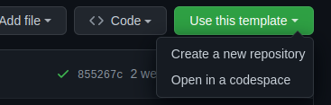
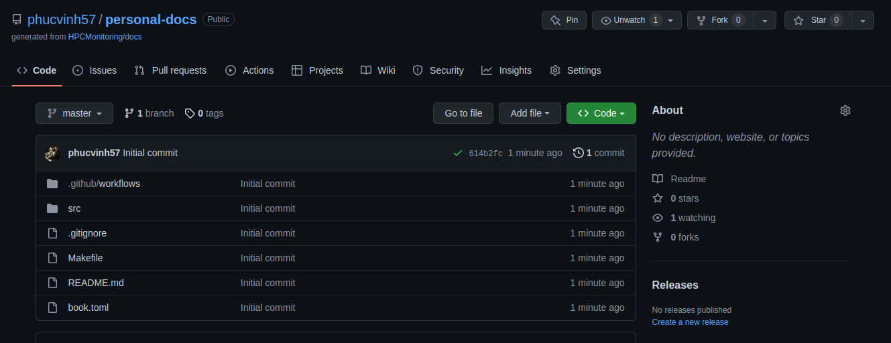
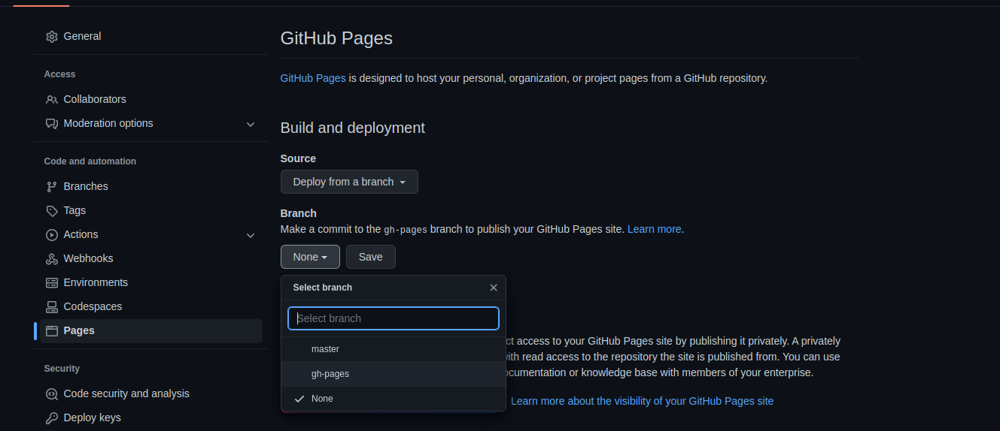

# HPC monitoring documentation

[](https://github.com/HPCMonitoring/docs/actions?workflow=Build%20and%20deploy) [](https://github.com/HPCMonitoring/docs/actions?workflow=Test)

## Installation

Download `mdbook` and add into `/usr/local/bin` folder:

```bash
curl -sSL https://github.com/rust-lang/mdBook/releases/download/v0.4.14/mdbook-v0.4.14-x86_64-unknown-linux-gnu.tar.gz | sudo tar -xz --directory=/usr/local/bin
```

## How to use

All contents of documentation in `src` folder. Do not modify other files directly.

To run this book:

```bash
mdbook serve [--port <your_port>]
```

If `--port` option is not provided, default host port is `3000`.

For book structure guide, visit <https://rust-lang.github.io/mdBook/format/summary.html>.

## Use this template to create your own document page

This section will show you how to use `gh-pages` to deploy this book on your own domain.

Firstly, click `Use this template` button & choose `Create a new repository`.



Then, you will be redirected to create new repository page of Github. Filter out informations and submit. The new repository should look like this:



Secondly, in your already created repository, visit `Setting` -> `Pages` and configure like this:



Finally, wait for some minutes and refresh current page. You will see the result:


